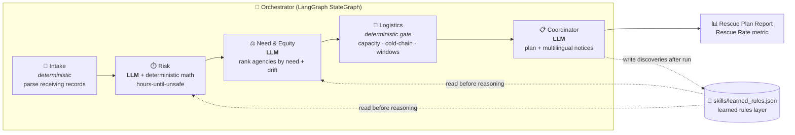

# 🥬 Perishable Rescue + Equity Coordinator

**A five-agent pipeline that decides, for a food bank's daily inbound food, which lots are about to expire, which underserved partner agency should receive them, whether a truck can actually carry them in time, and drafts the multilingual agency notification — and gets sharper every time it runs.**

Built for the [AI Objectives Institute](https://aiobjectives.org/) **AISCO Hackathon** (food banks + AI agents track), grounded in the real operations of the [Alameda County Community Food Bank (ACCFB)](https://www.accfb.org/).

---

## The problem

ACCFB and its partners distributed **60 million pounds of food in 2024 — the most in their history — through 400+ partner agencies**, matchmaking **510 scheduled weekly pickups** between donor grocers and community pantries ([ACCFB 2024 Annual Report](https://www.accfb.org/annual-report-2024/)). At that volume, two problems from their own challenge brief compound each other:

1. **Perishables age out.** Fresh produce and raw protein have a safe window measured in *hours*, not days. When reallocation is manual, lots quietly pass their safe-to-distribute point before anyone moves them.
2. **Allocation drifts from need.** Partner agencies' standing orders slowly diverge from what their neighborhood actually needs — a high-need pantry ends up bread-heavy while under-ordering produce and protein — and no one has time to catch it lot-by-lot.

**11% of Alameda County residents (182,080 people) were food insecure in 2023** ([Feeding America via Healthy Alameda County](https://www.healthyalamedacounty.org/indicators/index/view?indicatorId=2107&localeId=238)) — and that need is not evenly spread. Deep East Oakland and Fruitvale sit far above the county line; the Tri-Valley sits below it. Every pound wasted or mis-routed is a pound that didn't reach the neighborhoods furthest behind.

## The solution

Five specialized agents, each owning **exactly one constraint**, coordinated end-to-end by a [LangGraph](https://langchain-ai.github.io/langgraph/) orchestrator, with a **Skills/Rules layer that learns after every run**. This is built as production-oriented software — clean module boundaries, real config, documented interfaces — so each agent could later be pointed at ACCFB's real systems instead of our CSVs, not rewritten.



- **🧾 Intake** — deterministic. Parses raw receiving records into clean lot records. Parsing is not a judgment call, so no LLM.
- **⏱️ Risk** — deterministic, auditable core math (shelf life × condition vs. age, and lot quantity vs. the network's current movement velocity) decides *which lots are at risk and how many hours they have left*. A **real LLM call** then interprets edge cases and explains each flag in plain language. Reads the learned-rules layer first.
- **⚖️ Need & Equity** — **real LLM reasoning**. Ranks partner agencies by unmet need, capacity, refrigeration, hours, product fit, **and how far each agency's recent order pattern has drifted from its neighborhood's expected need**. Corrects drift instead of honoring it. Reads the learned-rules layer first.
- **🚚 Logistics** — **deliberately deterministic hard gate**. Vehicle capacity, cold-chain, delivery windows, and incremental stops are *facts, not vibes*. It can veto an equity-optimal match that physics won't allow, and cascade to the next feasible agency.
- **📋 Coordinator** — **real LLM synthesis**. Fuses the four upstream outputs into one rescue plan and drafts a short, warm notification per agency in **English, Spanish, and Chinese** — the languages ACCFB serves.

Every LLM-backed step has a **rule-based fallback**. With no API key, or if the API is down mid-demo, the pipeline produces the *same plan* using deterministic logic — it degrades, it never crashes.

## Impact metric

> **Rescue Rate = pounds allocated in time ÷ pounds at risk identified**

On the committed demo dataset the pipeline rescues **92%** (3,450 / 3,750 lbs) — placing 7 at-risk lots across three high-need Oakland/Hayward agencies and **correctly refusing** to put 300 lbs of raw pork on a non-refrigerated truck, flagging it for manual cold handling instead. A clean 100% would be a red flag; a food bank's real constraint is exactly this kind of tight-fleet tradeoff.

## Why multi-agent (this is the point, not decoration)

A single agent asked to judge shelf-life risk, rank agencies for equity, verify truck capacity, *and* write outreach — all in one prompt — will inevitably blur or drop one constraint, because it is juggling all of them at once. Food-safety judgment gets diluted by language-generation concerns; a hard logistics limit gets treated as a *suggestion* instead of a gate.

**Splitting the work by constraint means nothing gets silently ignored:**

- The **Risk** agent's shelf-life math can't be softened by a persuasive equity argument — they run in different agents.
- The **Logistics** gate is deterministic *on purpose*: a truck's capacity doesn't get reasoned away. It can and does **override** the equity-optimal choice when the cold chain can't be honored.
- The **Need & Equity** agent gets to focus its full reasoning budget on the one genuinely hard judgment call — who is most underserved — instead of spending it on arithmetic.

Each agent has a single, testable responsibility with a documented interface. You can read what it does without reading the others, and swap its internals (e.g., point Need & Equity at ACCFB's live CRM) without touching the rest.

## Why it keeps improving

After every run, the agents write what they learned — a shelf-life exception, an agency that keeps drifting bread-heavy despite high need — into `skills/learned_rules.json`. The **Risk** and **Need & Equity** agents read that layer *before* they reason on the next run.

Same pipeline, sharper priors over time. Run #1 is good; run #100 has confirmed which patterns are real and discovered new ones:

| | Fresh (seed) | After 100 runs |
|---|--:|--:|
| runs_completed | 0 | 100 |
| total learned rules | 4 | 6 |
| `R-002` raw-protein sub-48h (times reinforced) | 5 | 105 |

Two of those rules (`E-003`, `E-004`) **did not exist in the seed** — the system discovered that agencies A01 and A03 keep drifting and wrote itself a standing correction. See [`examples/learning_growth.md`](examples/learning_growth.md). Run `--fresh` vs. a warmed-up state to see the difference live.

## Run it

```bash
# 1. Setup (Python 3.10+)
python3.11 -m venv .venv && source .venv/bin/activate
pip install -r requirements.txt
cp .env.example .env        # optional: add an OpenAI/OpenRouter key for real LLM reasoning

# 2. Run the whole pipeline end-to-end (terminal report)
python orchestrator.py                # real LLM if a key is set, else rule-based fallback
python orchestrator.py --fresh        # ignore learned rules ("run #1" baseline)
python orchestrator.py --no-learn     # don't persist learning (keeps the seed clean)

# 3. Live visual demo (node graph + animated flow + streaming reasoning)
python server.py                      # then open http://localhost:8000
```

Everything runs **offline against the committed CSVs** — no live scraping, no camera, no voice.

## Repo layout

```
orchestrator.py      LangGraph pipeline + terminal report
server.py            FastAPI backend, streams run progress over SSE
llm.py               OpenAI-compatible client, cost tracking, fail-safe
config.py            central config (real config, not scattered constants)
agents/              one module per agent, one constraint each
skills/              learned_rules.json + the learning layer
data/                inventory, agencies, routes, shelf_life_rules (see docs/DATA_SOURCES.md)
frontend/            single-page node-graph visualization
examples/            committed proof: a full run + before/after learning
docs/                ARCHITECTURE.md, DATA_SOURCES.md
```

## Documentation

- **[docs/ARCHITECTURE.md](docs/ARCHITECTURE.md)** — per-agent deep dive, why LangGraph, why the learning loop matters.
- **[docs/DATA_SOURCES.md](docs/DATA_SOURCES.md)** — every field, real vs. synthetic, with links.
- **[examples/example_run_report.md](examples/example_run_report.md)** — a full committed run (reference only; the live judging run is real).
